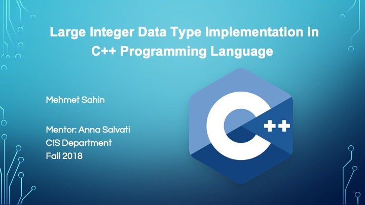
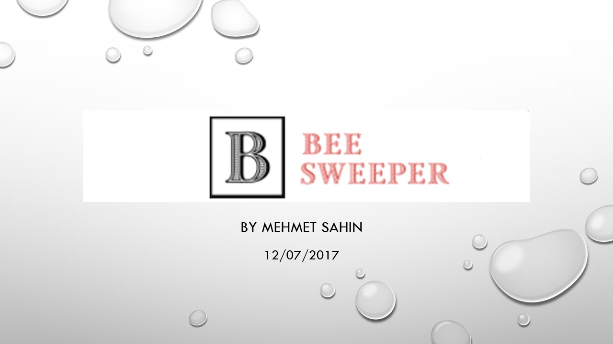

# Honors Projects at Borough of Manhattan Community College

1. [LargeInt Class in C++](https://github.com/mixemer/BMCC-Honors-Projects/tree/master/LargeInt-Fall2018)

2. Control NAO Robot

3. Minesweeper in Java

4. Ethnography
